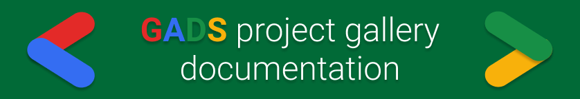

# GADS project gallery
<!-- ALL-CONTRIBUTORS-BADGE:START - Do not remove or modify this section -->

<!-- ALL-CONTRIBUTORS-BADGE:END -->

## Google Africa Developer Scholarship project gallery doc

Hey, congratulations on being accepted into the Google Africa Developer Scholarship program this year! At some point in the program, you will be asked to make some cool projects. This is a documentation guide created by past and present GADS learners and mentors, to help with general information on GADS projects. You will not only find information on GADS projects, you will also get to add the project\(s\) you made during the program to our project gallery. Adding your project here is optional, but adding your project is one of the many ways you become a [contributor](https://github.com/gads-projects/doc/blob/main/contributor.md) to the GADS project gallery doc.

## Contributors ✨

Thanks goes to these wonderful people ([emoji key](https://allcontributors.org/docs/en/emoji-key)):

<!-- ALL-CONTRIBUTORS-LIST:START - Do not remove or modify this section -->
<!-- prettier-ignore-start -->
<!-- markdownlint-disable -->
<table>
  <tr>
    <td align="center"><a href="https://github.com/Ifycode"> <b>Obiagba Mary Ifeoma</b></a> <a href="#mentoring-Ifycode" title="Mentoring">🧑‍🏫</a></td>
  </tr>
</table>

<!-- markdownlint-restore -->
<!-- prettier-ignore-end -->

<!-- ALL-CONTRIBUTORS-LIST:END -->

This project follows the [all-contributors](https://github.com/all-contributors/all-contributors) specification. Contributions of any kind welcome!