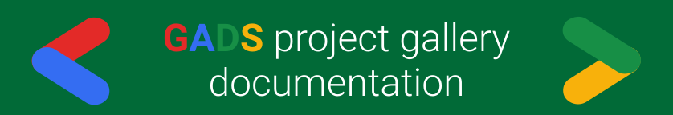

# GADS project gallery

## Google Africa Developer Scholarship project gallery doc

Hey, congratulations on being accepted into the Google Africa Developer Scholarship program this year! At some point in the program, you will be asked to make some cool projects. This is a documentation guide created by past and present GADS learners and mentors, to help with general information on GADS projects. You will not only find information on GADS projects, you will also get to add the project\(s\) you made during the program to our project gallery. Adding your GADS projects to the project gallery is [one of the many ways](https://obiagba-mary.gitbook.io/gads-projects/contribution-guide/contributing) you become a [contributor](https://github.com/gads-projects/doc/blob/main/contributor.md) to the GADS project gallery doc. The sections below contain information about GADS projects.

#### Learning phase and community projects
The GADS team usually introduce projects to work on towards the end of learning phase 1 and learning phase 2 respectively, based on the course content in the learning channels. Learners who make it to the project phase will be given another project to work on. These projects are very important to look out for and complete. The duration, deadlines and instructions on how to submit will be communicated to you when it is time for these projects. Projects given by the GADS team from learning phase 1 to the project phase are usually individual projects. The community project was introduced in 2020 and comes up sometime in between the project phase and the certification phase. For the community project, you can choose to make an individual project or choose to get assigned to a team. [Read about the GADS2020 community project here](https://gads.andela.com/community-projects).

#### Peer Learning Group projects
Mentors assigned to your Peer Learning Group (PLG) may give tasks or projects related to the content on the learning channels, based on what they think will help you. The tasks can be given to test you, to help you improve on particular areas and to help solidify knowledge of the things learnt before the projects come from the GADS team. They are usually much simpler than projects given by the GADS team. The tasks vary for PLG groups as it is at the mentors discretion. Learners are encouraged to participate in whatever tasks or projects given by the mentors assigned to their Peer Learning Groups.

